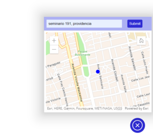

# xygo-widget

Map widget with integrated Xygo searcher

## Installation

```js
npm install widget-xygo
```

## Dev usage

### Import the package

```js
import { Widget } from 'widget-xygo';
```

### Instantiate the class

```js
const widget = new Widget ({
  apiKey: 'xxxxxxxxxxxxxxxxxxxx', // provide arcgis developer api key. Required
  position: 'bottom-left' || 'bottom-right' || 'top-left' || 'top-right' , // optional property: default value is 'bottom-right'
  button: true || false // optional property: default value is false
});
```
### Get coordinates
Get the coordinates of a specific point with a click on the map
```js
const coordinates = await widget.getCoords()
```

## Usage    
    

### Search by address    
Enter an address into the search box and press the Enter key or the Submit button.

### See the address object
If you go to the console of the inspect tool of your browser you can see the address object with its properties

```js
Calle: "SEMINARIO"  
Comuna: "PROVIDENCIA"  
DireccionCompleta: "SEMINARIO 191 DEPARTAMENTO 201, PROVIDENCIA, SANTIAGO, METROPOLITANA DE SANTIAGO"  
Id: "562110603501278917"  
IdPais: 56  
NivelPrecision: "Dirección exacta"  
Provincia: "SANTIAGO"  
Region: "METROPOLITANA DE SANTIAGO"  
Score: 1  
TipoDato: "address"  
Ubicacion: {lat: -33.44356568, lon: -70.62951751}  
```

### Search by coordinates    
Enter coordinates into the search box with the following format: [latitude, longitude]

Example:
[-33.44356568, -70.62951751]